# MediLens AI - Deterministic AI & RAG Pipeline Design

## 1. Core Engineering Principle

> **Fundamental Invariant**: The Large Language Model (LLM) is **strictly forbidden** from acting as the source of truth for extracted laboratory values, unit conversions, reference-range comparisons, or clinical emergency triggers.
>
> All values, intervals, statuses (`LOW`, `NORMAL`, `HIGH`, `CRITICAL`, `UNKNOWN`), and red-flag alerts are computed **deterministically** via OpenCV, PaddleOCR, Tesseract, regular expressions, spatial layout geometry, and relational clinical database lookups.
>
> The LLM is restricted exclusively to **synthesizing patient-friendly educational explanations** strictly bounded by verified medical reference chunks retrieved via RAG.

---

## 2. End-to-End Processing Pipeline

```mermaid
flowchart TD
    RawFile["Report File (PDF / PNG / JPEG)"] --> Preprocess["Stage 1: OpenCV Image Preprocessing"]
    
    subgraph PreprocessingDetails["Stage 1: Preprocessing"]
        PDFToImage["PDF Page Rendering (300 DPI)"]
        Grayscale["Grayscale Conversion"]
        Deskew["Hough Line Transform Deskew"]
        Denoise["Bilateral Filtering (Preserves Text Edges)"]
        CLAHE["CLAHE Contrast Enhancement"]
        PDFToImage --> Grayscale --> Deskew --> Denoise --> CLAHE
    end
    Preprocess --> OCR["Stage 2: Dual-Engine OCR Strategy"]

    subgraph OCRDetails["Stage 2: Dual OCR"]
        Paddle["PaddleOCR (Primary Engine)"]
        ConfidenceCheck{Mean Confidence >= 0.70?}
        TesseractFallback["Tesseract OCR Engine (--psm 6)"]
        Paddle --> ConfidenceCheck
        ConfidenceCheck -->|Yes| RawTokens["Structured Text & Bounding Boxes"]
        ConfidenceCheck -->|No| TesseractFallback --> RawTokens
    end
    OCR --> Layout["Stage 3: Layout & Spatial Analysis"]

    subgraph ExtractionDetails["Stage 3 & 4: Extraction & Normalization"]
        RowCluster["Spatial Y-Coordinate Line Clustering"]
        BiomarkerRegex["Biomarker Name + Value + Unit Regex"]
        CanonicalAlias["Canonical Dictionary Mapping (LOINC/SNOMED)"]
        UnitConvert["Deterministic Unit Converter (e.g., mg/dL <-> mmol/L)"]
        RowCluster --> BiomarkerRegex --> CanonicalAlias --> UnitConvert
    end
    Layout --> Validation["Stage 5: Deterministic Clinical Validation"]

    subgraph ValidationDetails["Stage 5: Range Validation"]
        RefLookup["Demographic Range Lookup (Age, Gender)"]
        StatusEval{"Range Comparison Logic"}
        StatusEval -->|Value < Critical Low| Crit["CRITICAL"]
        StatusEval -->|Value < Low| Low["LOW"]
        StatusEval -->|Low <= Value <= High| Norm["NORMAL"]
        StatusEval -->|Value > High| High["HIGH"]
        StatusEval -->|Value > Critical High| Crit
        StatusEval -->|Unit/Range Missing| Unk["UNKNOWN"]
    end
    Validation --> DBStore[(PostgreSQL Database: measurements)]
    DBStore --> RAG["Stage 6: Evidence-Grounded RAG Pipeline"]

    subgraph RAGDetails["Stage 6: RAG & Safety Guardrail"]
        QueryVector["Vector Embedding of User Query"]
        PgVectorSearch["pgvector HNSW Cosine Search (Threshold >= 0.75)"]
        EvidenceCheck{Sufficient Evidence Found?}
        GroundedPrompt["Grounded Prompt Construction (Retrieved Chunks Only)"]
        Refusal["Explicit Refusal: 'No verified evidence available'"]
        LLMGen["LLM Educational Synthesis"]
        SafetyFilter["Clinical Safety Guardrail Validator"]
        
        QueryVector --> PgVectorSearch --> EvidenceCheck
        EvidenceCheck -->|Yes| GroundedPrompt --> LLMGen --> SafetyFilter
        EvidenceCheck -->|No| Refusal
    end
    RAGDetails --> Output["Grounded Patient Explanation with Provenance"]
```



---

## 3. Detailed Stage Specifications

### Stage 1: Document Preprocessing (OpenCV)
1. **Multi-Page Handling**: Multi-page PDF documents are rendered to PNG at 300 DPI using `pdf2image` and `poppler`.
2. **Deskewing**: Computes dominant orientation angle using Hough Line Transform on edge-detected text blocks. If rotation angle $\theta \in [-45^\circ, +45^\circ]$, the image is rotated to horizontal alignment.
3. **Denoising**: Bilateral filter reduces high-frequency background noise while preserving sharp character edges.
4. **Contrast Adjustment**: Contrast Limited Adaptive Histogram Equalization (CLAHE) with `clipLimit=2.0` and `tileGridSize=(8,8)` ensures faint dot-matrix lab printouts remain legible.

### Stage 2: Dual-Engine OCR Strategy
- **Primary Engine**: **PaddleOCR** (Mobile or Server model) with integrated direction classification. Extracts word-level and line-level bounding boxes with confidence scores.
- **Fallback Trigger**: If the mean confidence score of extracted text lines falls below 0.70 ($70\%$), or if zero text lines are recognized, the preprocessed image is routed to **Tesseract OCR** with Page Segmentation Mode `PSM 6` (uniform block of text) and `PSM 11` (sparse text).
- **Engine Provenance**: The resulting record in `report_pages` records `ocr_engine_used` and `ocr_confidence_score`.

### Stage 3 & 4: Biomarker Extraction & Normalization
1. **Spatial Row Clustering**: Tokens sharing intersecting vertical coordinates ($|Y_1 - Y_2| \le \Delta Y$) are grouped into table rows.
2. **Entity Extraction**:
   - Column 1: Test Name (e.g., "FASTING BLOOD SUGAR").
   - Column 2: Observed Value (e.g., "112.5").
   - Column 3: Measurement Unit (e.g., "mg/dL").
   - Column 4: Reference Interval (e.g., "70.0 - 99.0").
3. **Canonical Alias Resolution**:
   - Matches extracted test names against canonical aliases stored in `biomarkers.aliases_json`:
     - `"FBS"`, `"FBG"`, `"Fasting Blood Glucose"` $\to$ `Fasting Blood Glucose` (LOINC `1558-6`).
     - `"Hb"`, `"HGB"`, `"Haemoglobin"` $\to$ `Hemoglobin` (LOINC `718-7`).
4. **Deterministic Unit Normalization**:
   - Compares extracted unit with canonical standard unit.
   - If a recognized conversion factor exists (e.g., Cholesterol $\text{mmol/L} \times 38.67 = \text{mg/dL}$), converts magnitude and normalizes unit.
   - Preserves `observed_value_raw` and `extracted_unit` untouched for clinical auditability.

### Stage 5: Deterministic Reference-Range Validation
- Evaluates `normalized_value_numeric` against demographic-matched intervals in `reference_ranges` based on patient age and gender.
- **Strict Classification Logic**:
  ```python
  if critical_low is not None and value <= critical_low:
      status = "CRITICAL"
  elif critical_high is not None and value >= critical_high:
      status = "CRITICAL"
  elif value < low_value:
      status = "LOW"
  elif value > high_value:
      status = "HIGH"
  elif low_value <= value <= high_value:
      status = "NORMAL"
  else:
      status = "UNKNOWN"
  ```
- If extracted unit cannot be converted or reference range is undefined, status is assigned `UNKNOWN`.

---

## 4. Controlled Medical Knowledge RAG Pipeline

### 4.1 Ingestion & Chunking
- Authoritative medical guidelines (e.g., WHO, ADA, NIH, Mayo Clinic) are ingested into `medical_sources`.
- Documents undergo semantic section chunking (target size: 400 tokens with 50-token context overlap).
- Embeddings are generated using `text-embedding-3-small` (1536 dimensions) and stored in `knowledge_chunks(embedding)`.

### 4.2 Semantic Retrieval & Refusal Barrier
- Incoming queries are vectorized and matched against `knowledge_chunks` using cosine distance:
  $$1 - (\vec{u} \cdot \vec{v}) / (\|\vec{u}\| \|\vec{v}\|)$$
- Retrieval is indexed via PostgreSQL HNSW.
- **Evidence Threshold Barrier**:
  - Top-$K$ chunks ($K=3$) must exhibit cosine similarity $\ge 0.75$.
  - If no chunks meet this threshold, the model executes a deterministic refusal:
    *"MediLens AI cannot find verified clinical literature to substantiate an answer to this inquiry. Please consult a licensed physician."*

### 4.3 Grounded Prompt Construction & Safety Guardrails
The system prompt enforces strict constraints:
```text
You are MediLens AI, an educational healthcare assistant.
Answer the patient's inquiry strictly and solely using the provided medical evidence chunks below.
Every factual statement must be cited with [Source X].
Under no circumstances may you:
1. Provide a definitive diagnosis of any disease.
2. Recommend starting, stopping, or altering any medication dosage.
3. Suggest home remedies or treatments for emergency symptoms.
If the retrieved evidence does not explicitly address the question, reply that evidence is insufficient.
```

### 4.4 Post-Generation Safety Guardrail
Before sending the response to the user:
- RegEx and heuristic filter scans for diagnostic declarations (e.g., `"you have diabetes"`, `"you are diagnosed with"`).
- RegEx filter scans for prescription instructions (e.g., `"take 50mg of"`, `"stop taking"`).
- If flagged, the response is replaced with a safe clinician referral template.
- Mandatory disclaimer is appended: *"MediLens AI provides educational information and is not a substitute for professional clinical judgment."*
