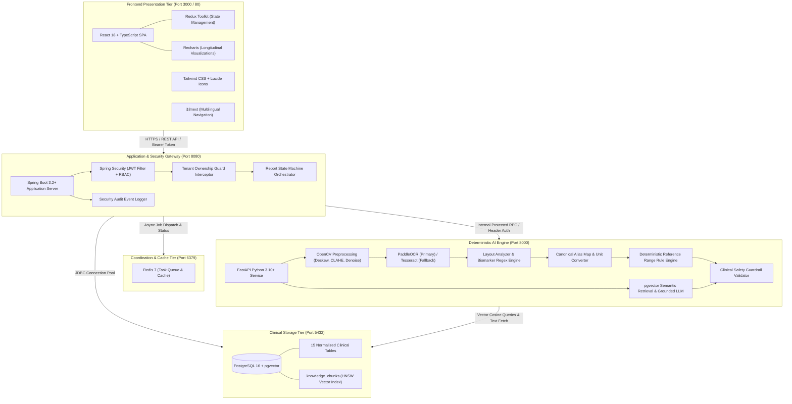
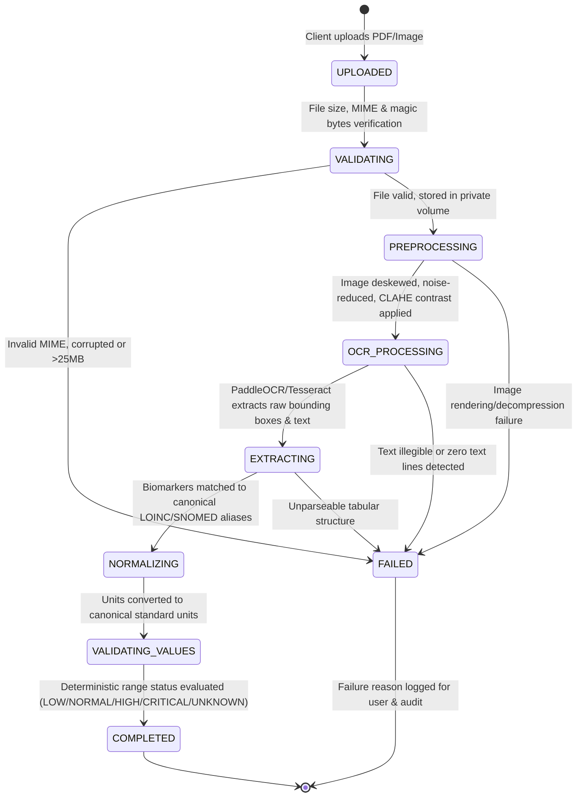

# MediLens AI - System Architecture Documentation

## 1. Executive Summary & Design Principles

MediLens AI is engineered as an academic and research prototype for clinical laboratory report analysis and healthcare navigation. The architecture strictly decouples **deterministic extraction and validation** from **probabilistic natural language generation**.

### Core Invariants
1. **Zero LLM Dependency for Clinical Measurement Truth**: Optical Character Recognition (OCR), layout extraction, biomarker name resolution, unit normalization, and reference-range checking are 100% deterministic algorithms.
2. **Explicit Uncertainty**: When an observed value or unit cannot be reliably extracted or matched to a reference range, it transitions to an explicit `UNKNOWN` state with low confidence. Guessing or LLM interpolation is prohibited.
3. **Evidence-Grounded RAG**: Explanations generated by LLMs are strictly bounded by retrieved authoritative clinical guidelines (`medical_sources`). Every medical assertion includes citation IDs.
4. **Strict Multi-Tenant Isolation**: Health records are cryptographically and relationally partitioned by `user_id`. Direct object references without ownership validation are impossible.

---

## 2. High-Level Component Topology

---

## 3. Asynchronous Report Processing State Machine

Report ingestion executes asynchronously to prevent HTTP blocking on compute-heavy OCR and document layout parsing.

### State Machine Transition Contract
| Current State | Target State | Trigger Condition |
| :--- | :--- | :--- |
| `UPLOADED` | `VALIDATING` | Worker pulls report ID from queue. |
| `VALIDATING` | `PREPROCESSING` | MIME type confirmed (`application/pdf`, `image/png`, `image/jpeg`), size $\le$ 25MB, sha256 checksum recorded. |
| `PREPROCESSING` | `OCR_PROCESSING` | PDF converted to high-DPI image pages; OpenCV applies deskew and contrast enhancement. |
| `OCR_PROCESSING`| `EXTRACTING` | Text lines and word bounding boxes generated. If confidence < 0.70, Tesseract fallback executes. |
| `EXTRACTING` | `NORMALIZING` | Regular expressions and layout coordinates associate biomarker names with observed numeric strings and units. |
| `NORMALIZING` | `VALIDATING_VALUES`| Names mapped to canonical dictionary; unit conversion algorithms normalize magnitudes. |
| `VALIDATING_VALUES`| `COMPLETED` | Evaluated against patient age/gender reference ranges; values stored in `measurements` table. |
| *Any State* | `FAILED` | Any unhandled exception or corrupt input triggers transition, updating `failure_reason`. |

---

## 4. Component Deep Dives

### 4.1 Frontend Presentation Tier (React 18 + TypeScript)
- **Role**: Provides a modern, responsive, accessible clinical dashboard.
- **State Management**: Redux Toolkit for user auth, active report details, and real-time processing status polling.
- **Data Visualization**: Recharts for multi-point longitudinal trends of individual biomarkers over time (e.g., Hemoglobin across months).
- **Internationalization**: `i18next` for seamless English/Spanish/regional localization.
- **Safety Prompts**: Prominent, persistent non-diagnostic clinical disclaimer banner across all views.

### 4.2 Application Gateway & Backend (Spring Boot 3)
- **Role**: Serves as the central API gateway, authorization engine, and relational orchestrator.
- **Security**: Spring Security with stateless JWT validation. Every request runs through an authorization filter ensuring `resource.user_id == securityContext.principal.id`.
- **Storage Management**: Manages private file storage (`/var/medilens/reports/{userId}/{reportId}`) preventing unauthorized public HTTP file access.
- **Audit Logging**: Emits immutable security logs to `audit_logs` table for compliance and forensic analysis.

### 4.3 Deterministic AI Engine (FastAPI + Python)
- **Role**: Performs heavy OCR, layout extraction, normalization, and RAG knowledge search.
- **Isolation**: Runs in an isolated Docker container with specialized C++ libraries (Poppler, Tesseract, PaddlePaddle).
- **Security**: Rejects any external client requests; strictly listens on internal Docker network, validated via `X-Internal-API-Key`.
- **RAG Subsystem**:
  - Semantic Chunking: 400-token chunks with 50-token context overlap.
  - High-Speed Retrieval: PostgreSQL `pgvector` index with HNSW cosine distance (`vector_cosine_ops`).
  - Refusal Mechanism: If no chunk satisfies cosine similarity threshold ($S \ge 0.78$), the model produces a standardized fallback: *"No verified clinical evidence could be retrieved to substantiate an answer to this query."*

---

## 5. Failure Modes & Resilience Engineering

1. **OCR Engine Crash or Timeout**:
   - Primary PaddleOCR timeout is set to 30 seconds per page.
   - If PaddleOCR fails or returns low confidence (< 0.70), execution falls back to Tesseract OCR with `--psm 6`.
   - If both fail, report is marked `FAILED` with `failure_reason = "Unreadable document quality: Text could not be extracted with sufficient confidence."`
2. **Ambiguous or Non-Standard Laboratory Units**:
   - If a lab reports units that cannot be converted to canonical units (e.g., non-standard institutional titrations), the observed value is recorded as raw text, but the validation status is flagged `UNKNOWN`.
3. **Database Connectivity Interruption**:
   - Connection pool retry with exponential backoff in Spring Boot (HikariCP).
   - Redis task broker maintains unacknowledged jobs for automatic retry upon worker reconnection.
