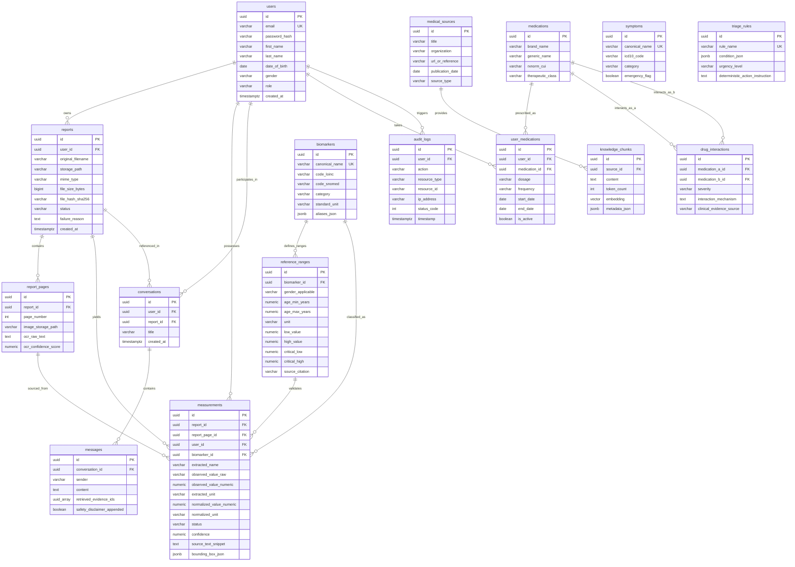

# MediLens AI - Database Entity-Relationship Diagram & Schema Documentation

## 1. Entity-Relationship Diagram (ERD)

---

## 2. Table Specifications & Cardinalities

### 1. `users`
- **Purpose**: System identity and demographics (essential for age- and sex-stratified reference intervals).
- **Security**: Passwords hashed with BCrypt ($cost \ge 12$).
- **Cardinality**: 1 User $\to$ N Reports, N Measurements, N Conversations, N User_Medications.

### 2. `reports`
- **Purpose**: Tracks original uploaded documents and lifecycle state machine.
- **Constraints**: Enforces maximum upload size (25MB) and strict MIME check (`application/pdf`, `image/png`, `image/jpeg`).
- **Cascade**: Deleting a report automatically deletes its associated pages and extracted measurements.

### 3. `report_pages`
- **Purpose**: Stores individual rendered pages for multi-page PDF documents.
- **Provenance**: Retains OCR engine name (`paddleocr` or `tesseract`), raw extracted text, and confidence score.

### 4. `biomarkers`
- **Purpose**: Master vocabulary mapping extracted aliases (e.g., `"Hb"`, `"HGB"`, `"Haemoglobin"`) to canonical medical concepts (LOINC `718-7`, SNOMED `38082009`).
- **Index**: GIN index on `aliases_json` for $O(1)$ JSON array lookups.

### 5. `reference_ranges`
- **Purpose**: Demographic-stratified biological reference intervals.
- **Invariants**: `low_value <= high_value`. Critical boundaries (`critical_low`, `critical_high`) designate immediate clinical alerts.

### 6. `measurements`
- **Purpose**: Core clinical data table storing every extracted and validated biomarker reading.
- **Audit & Provenance**: Stores raw observed string, parsed numeric value, extracted unit, normalized value, bounding box coordinates, and exact text snippet from which the value was extracted.

### 7. `medical_sources`
- **Purpose**: Provenance tracking for clinical guidelines and literature ingested into the RAG knowledge base.
- **Attributes**: Organization, publication date, version, guideline type.

### 8. `knowledge_chunks`
- **Purpose**: Text chunks split from medical sources with 1536-dimensional vector embeddings.
- **Index**: HNSW (Hierarchical Navigable Small World) index with `vector_cosine_ops` for sub-10ms semantic similarity retrieval.

### 9. `conversations` & 10. `messages`
- **Purpose**: Threaded chat history between users and the clinical information assistant.
- **Provenance**: Each assistant message stores `retrieved_evidence_ids (UUID[])` directly referencing the `knowledge_chunks` utilized to formulate the response.

### 11. `medications` & 12. `user_medications`
- **Purpose**: Patient active and past prescription/OTC medications mapped to RxNorm identifiers.

### 13. `drug_interactions`
- **Purpose**: Pre-computed deterministic pairwise drug interaction matrix.
- **Severities**: `MINOR`, `MODERATE`, `MAJOR`, `CONTRAINDICATED`.

### 14. `symptoms` & 15. `triage_rules`
- **Purpose**: Rule-based symptom catalog and emergency triage evaluator.
- **Clinical Invariant**: Immediate emergency guidance is evaluated deterministically against `condition_json` without consulting an LLM.

### 16. `audit_logs`
- **Purpose**: Immutable security audit trail recording authentication attempts, report uploads, and data access.

---

## 3. Indexing & Performance Strategy
1. **Tenant Filtering**: Composite indexes on `(user_id, created_at DESC)` and `(user_id, biomarker_id, measurement_date ASC)` guarantee fast longitudinal query execution.
2. **JSONB Lookups**: GIN indexes on `biomarkers(aliases_json)` and `knowledge_chunks(metadata_json)`.
3. **High-Speed Vector Search**: HNSW index on `knowledge_chunks(embedding)` using `m = 16, ef_construction = 64` achieves >99% recall with millisecond query latencies.
