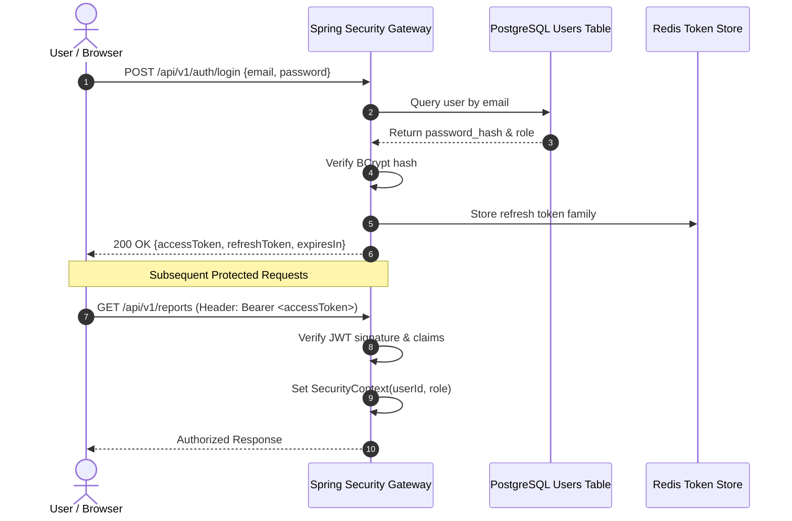
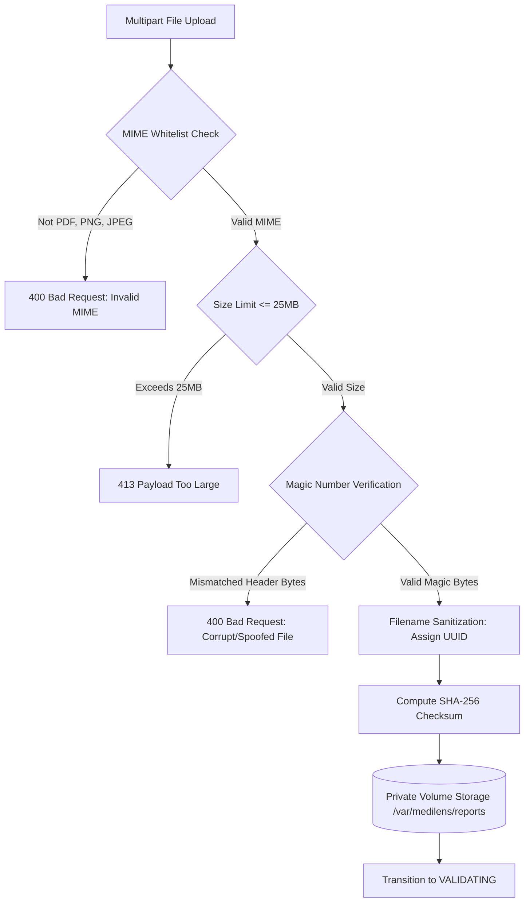

# MediLens AI - Security & Privacy Architecture Design

## 1. Threat Modeling & Security Philosophy

Medical laboratory data constitutes Protected Health Information (PHI). MediLens AI is architected using defense-in-depth principles aligned with HIPAA and GDPR data protection mandates:

1. **Confidentiality**: Health records and uploaded diagnostic documents must never be accessible across unauthorized user boundaries.
2. **Integrity**: Laboratory measurements, once validated and saved, are immutable and retain complete provenance back to the original source text snippet and image coordinates.
3. **Availability & Auditability**: Every access, read, and write operation on patient data is logged in an append-only audit trail.

---

## 2. Authentication & Identity Management

### 2.1 Token Strategy
- **Standard**: Stateless JSON Web Tokens (JWT) signed using HMAC-SHA256 (minimum key length 256 bits).
- **Access Tokens**: Short-lived (valid for 1 hour or configured up to 24 hours in dev), containing user UUID, email, and assigned roles.
- **Refresh Tokens**: Stored hashed in Redis/database with a 7-day expiration. Upon usage, tokens rotate automatically; re-use of an old refresh token invalidates the entire token family.
- **Password Hashing**: BCrypt algorithm with a minimum cost factor of 12. Plaintext passwords never touch logs or persistent storage.



---

## 3. Strict Tenant Isolation & Authorization Guardrails

### 3.1 Role-Based Access Control (RBAC)
- `ROLE_PATIENT`: Default role. Can upload reports, view only their own reports, measurements, longitudinal trends, and chat sessions.
- `ROLE_CLINICIAN`: Can view delegated patient reports and review deterministic validation flags.
- `ROLE_ADMIN`: System administration, viewing aggregated audit metrics and managing master biomarker catalogs. **Restricted from viewing private patient medical reports.**

### 3.2 Invariable Ownership Verification (Anti-IDOR)
To prevent Insecure Direct Object Reference (IDOR) attacks:
- **No naked `findById(id)` queries on patient data**: Every database query for reports, pages, measurements, or conversations enforces the user predicate:
  ```sql
  SELECT * FROM reports WHERE id = :reportId AND user_id = :authenticatedUserId;
  ```
- Any attempt to access a resource belonging to another user results in an immediate `403 Forbidden` response and generates a high-severity entry in `audit_logs`.

---

## 4. Document Ingestion & Storage Security

Uploaded medical reports present significant attack vectors (malicious payloads, ZIP bombs, polyglot files, path traversal).



### 4.1 Strict Upload Validation Rules
1. **MIME Whitelist**: Only `application/pdf`, `image/png`, `image/jpeg`.
2. **Magic Number Verification**: Inspects actual header bytes of the uploaded stream:
   - PDF: `%PDF-` (`0x25 0x50 0x44 0x46`)
   - PNG: `\x89PNG\r\n\x1a\n` (`0x89 0x50 0x4E 0x47 0x0D 0x0A 0x1A 0x0A`)
   - JPEG: `\xFF\xD8\xFF`
3. **Filename Sanitization**: Client-supplied filenames are never used as filesystem paths. The file is saved as:
   ```text
   /var/medilens/reports/{userId}/{uuid}.{ext}
   ```
4. **Private Storage Volume**: Storage directories are not mounted under any public web server directory. Files can only be retrieved via authenticated streaming endpoints in Spring Boot.

---

## 5. Network & Inter-Service Security

- **AI Service Isolation**: The FastAPI AI service binds only to the internal Docker bridge network (`medilens_network`). It is not exposed to host ports in production.
- **Shared Secret Verification**: All requests from the Spring Boot backend to the FastAPI AI service must transmit a pre-shared header:
  ```http
  X-Internal-API-Key: ${INTERNAL_API_KEY}
  ```
  Requests lacking this header are rejected with `401 Unauthorized`.

---

## 6. Immutable Audit Logging

Every security-sensitive event is captured synchronously in the `audit_logs` table:
- User login attempts (success and failure).
- Report upload, status query, and report deletion.
- Measurement export and historical trend viewing.
- Conversational assistant queries and emergency triage evaluations.

### Audit Log Record Structure
| Field | Type | Description |
| :--- | :--- | :--- |
| `id` | UUID | Unique event identifier. |
| `user_id` | UUID | Authenticated user (or NULL if unauthenticated). |
| `action` | VARCHAR | Operation name (e.g., `REPORT_UPLOADED`, `UNAUTHORIZED_ACCESS_ATTEMPT`). |
| `resource_type` | VARCHAR | Entity touched (`REPORT`, `MEASUREMENT`, `AUTH`). |
| `resource_id` | VARCHAR | Target entity identifier. |
| `ip_address` | VARCHAR | Client IP address. |
| `status_code` | INTEGER | HTTP response status code. |
| `timestamp` | TIMESTAMPTZ | UTC timestamp of event. |
